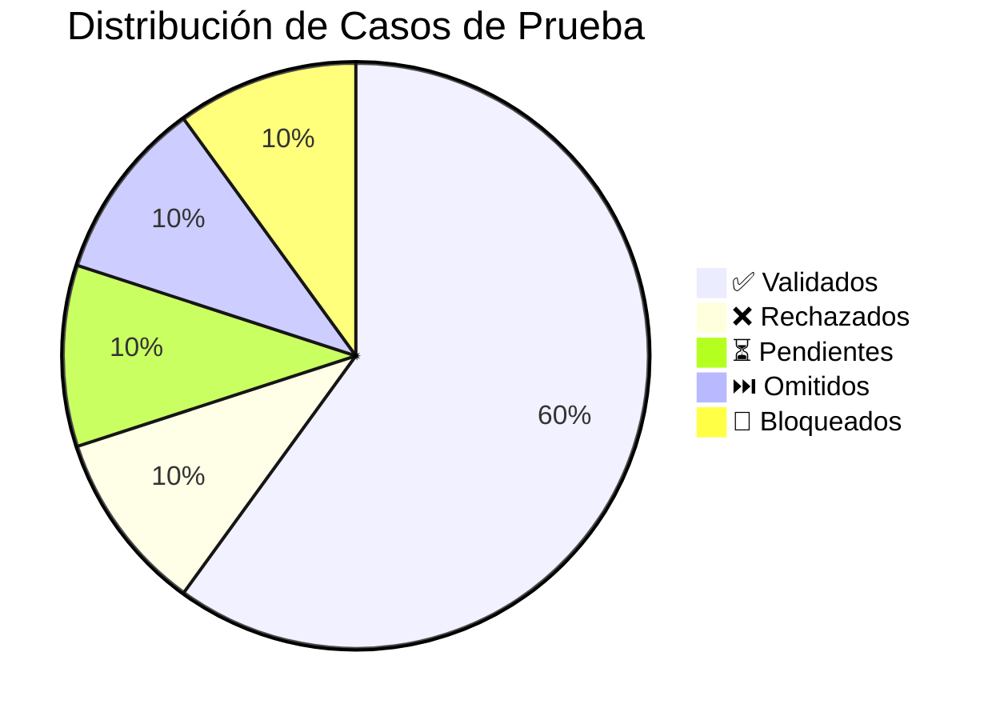

# Informe de Pruebas: smoke-mercadolibre-20250311_123200

Fecha de ejecución: 2025-03-11 12:32:00

## Resumen Numérico

- Total de casos: 10
- ✅ Validados: 6
- ❌ Rechazados: 1
- ⏳ Pendientes: 1
- ⏭️ Omitidos: 1
- 🚫 Bloqueados: 1

## Resumen Visual

## Detalle de casos

| ID | Descripción | Estado | Observaciones | Evidencia |
|-----|------------|--------|---------------|-----------|
| TC1 | Verificar que la página principal de MercadoLibre carga correctamente | ✅ Validado | La página principal carga en menos de 3 segundos, mostrando todos los elementos correctamente | /capturas/ml_home.png |
| TC2 | Comprobar que la barra de búsqueda funciona correctamente | ✅ Validado | La búsqueda de 'iPhone 15' muestra resultados relevantes | /capturas/ml_busqueda.png |
| TC3 | Verificar que el sistema de filtros funciona adecuadamente | ⏳ Pendiente |  |  |
| TC4 | Comprobar que el proceso de inicio de sesión funciona correctamente | ❌ Rechazado | Al intentar iniciar sesión con credenciales válidas, ocasionalmente muestra error de timeout | /capturas/ml_login_error.png |
| TC5 | Verificar que el carrito de compras permite agregar productos | ✅ Validado | Se agregaron 3 productos diferentes al carrito sin problemas | /capturas/ml_carrito.png |
| TC6 | Comprobar que se puede acceder a las categorías principales | ✅ Validado | Todas las categorías son accesibles y muestran productos | /capturas/ml_categorias.png |
| TC7 | Verificar que las ofertas del día se muestran correctamente | 🚫 Bloqueado | No se pudo acceder a la sección de ofertas por mantenimiento | /capturas/ml_ofertas_error.png |
| TC8 | Comprobar que la sección de ayuda es accesible | ✅ Validado | La sección de ayuda muestra todas las opciones correctamente | /capturas/ml_ayuda.png |
| TC9 | Verificar que el cambio de ubicación funciona correctamente | ⏭️ Omitido | No se realizó la prueba por falta de tiempo |  |
| TC10 | Comprobar que la visualización de detalles de producto es correcta | ✅ Validado | Los detalles de producto muestran imágenes, descripción y precio correctamente | /capturas/ml_producto.png |

## Observaciones generales

Este informe corresponde a las pruebas de humo realizadas en la plataforma de MercadoLibre el 11 de marzo de 2025. Se han identificado los siguientes problemas críticos:

1. **Inicio de sesión intermitente**: Se detectaron problemas ocasionales al iniciar sesión, que podrían afectar a la experiencia de usuario.
2. **Sección de ofertas en mantenimiento**: La sección de ofertas del día no está disponible actualmente, lo que podría impactar en las ventas promocionales.

## Recomendaciones

1. Investigar y solucionar el problema de timeout en el inicio de sesión.
2. Establecer una comunicación clara con los usuarios sobre el mantenimiento de la sección de ofertas.
3. Completar las pruebas pendientes del sistema de filtros.
4. Programar una nueva sesión para verificar el cambio de ubicación.

## Próximos pasos

1. Realizar pruebas de regresión una vez solucionados los problemas detectados.
2. Ampliar las pruebas para incluir el proceso completo de compra.
3. Verificar la funcionalidad en diferentes dispositivos y navegadores.
